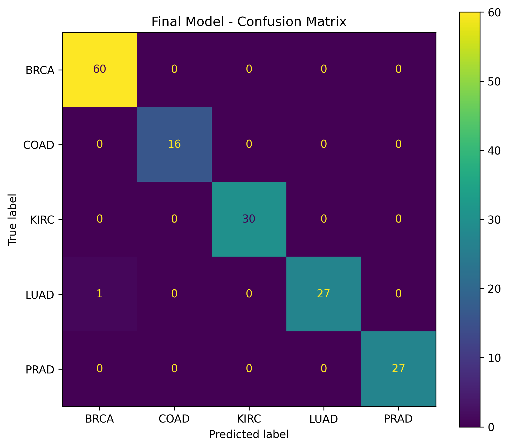
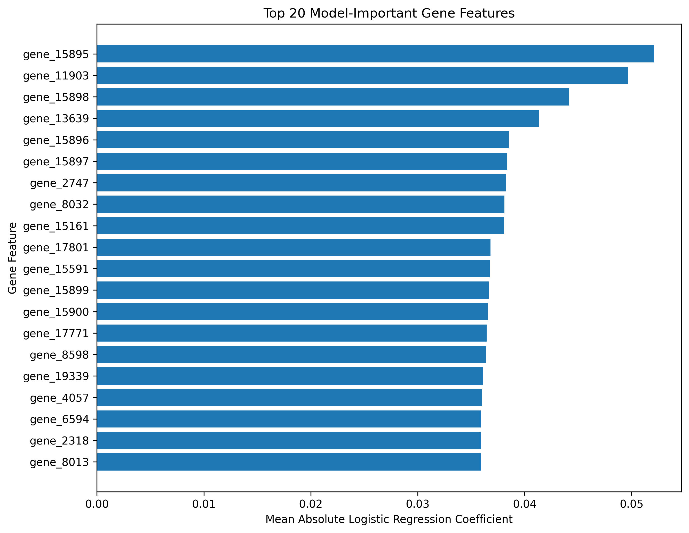

# cancer-gene-expression-ml

Machine learning-based cancer type classification using gene expression data and feature selection.

## Project Overview

This project develops a machine learning pipeline to classify cancer types using high-dimensional gene expression data.

The analysis uses RNA-Seq gene expression profiles from five cancer types:

- BRCA — Breast Invasive Carcinoma
- KIRC — Kidney Renal Clear Cell Carcinoma
- COAD — Colon Adenocarcinoma
- LUAD — Lung Adenocarcinoma
- PRAD — Prostate Adenocarcinoma

Because the dataset contains thousands of gene features but relatively few samples, feature selection is used to identify informative genes and reduce the dimensionality of the data.

The final pipeline uses ANOVA-based feature selection followed by feature scaling and Logistic Regression classification.

## Dataset

The dataset is the **Gene Expression Cancer RNA-Seq** dataset from the UCI Machine Learning Repository.

- Samples: 801
- Gene expression features: 20,531
- Cancer types: 5
- Missing values: None
- Data type: RNA-Seq gene expression

The dataset is a subset of The Cancer Genome Atlas (TCGA) Pan-Cancer project.

Source: [UCI Machine Learning Repository](https://archive.ics.uci.edu/dataset/401/gene%2Bexpression%2Bcancer%2Brna%2Bseq)

The raw dataset is not included in this repository.

## Methodology

The machine learning workflow consists of the following steps:

1. Load the RNA-Seq gene expression data and cancer-type labels.
2. Perform exploratory data analysis to examine sample distribution, missing values, and gene variability.
3. Split the data into training and test sets using stratified sampling.
4. Remove zero-variance features using the training data only.
5. Apply ANOVA-based feature selection to identify genes that differ across cancer types.
6. Compare different numbers of selected genes using 5-fold stratified cross-validation.
7. Standardize the selected features.
8. Train classification models including:
   - Logistic Regression
   - Linear Support Vector Machine
   - Random Forest
9. Evaluate model performance using accuracy, macro F1-score, classification reports, and confusion matrices.
10. Analyze Logistic Regression coefficients to identify model-important gene features.

Feature selection is performed without using the held-out test set, helping to avoid data leakage.

## Results

The final pipeline selected 500 gene features using ANOVA-based feature selection and used Logistic Regression for classification.

### Model Performance

| Model | Accuracy | Macro F1 |
|---|---:|---:|
| Logistic Regression | 99.38% | 99.47% |
| Linear SVM | 99.38% | 99.47% |
| Random Forest | 98.76% | 98.93% |

### Final Model

The final 500-gene Logistic Regression pipeline achieved:

- Accuracy: **99.38%**
- Macro F1-score: **99.47%**

The model correctly classified most samples across all five cancer types. The only observed misclassification in the held-out test set involved a LUAD sample.

### Feature Selection

Five-fold stratified cross-validation was used to compare different numbers of selected genes.

| Number of Genes | Mean CV Accuracy | Mean CV Macro F1 |
|---:|---:|---:|
| 100 | 99.53% | 99.61% |
| 500 | 99.84% | 99.87% |
| 1000 | 99.84% | 99.87% |
| 2000 | 99.84% | 99.87% |

Since increasing the feature count beyond 500 did not improve cross-validation performance, **500 genes were selected as a more compact feature set**.

### Model Interpretation

Logistic Regression coefficients were used to identify model-important gene features.

The top-ranked feature was **gene_15895**, followed by **gene_11903** and **gene_15898**.

These feature IDs represent the identifiers provided in the dataset and are treated as model-important features rather than biologically validated gene markers.

## Results Visualization

### Final Model Confusion Matrix

The confusion matrix shows the classification performance of the final 500-gene Logistic Regression model across the five cancer types.



### Top Model-Important Gene Features

The following plot shows the 20 gene features with the highest mean absolute Logistic Regression coefficients.




## Project Structure

```text
cancer-gene-expression-ml/
│
├── data/
│   ├── raw/
│   └── processed/
│
├── notebooks/
│   └── 01_data_exploration.ipynb
│
├── results/
│   ├── final_confusion_matrix.png
│   └── top_20_gene_importance.png
│
├── src/
│
├── .gitignore
├── README.md
└── requirements.txt